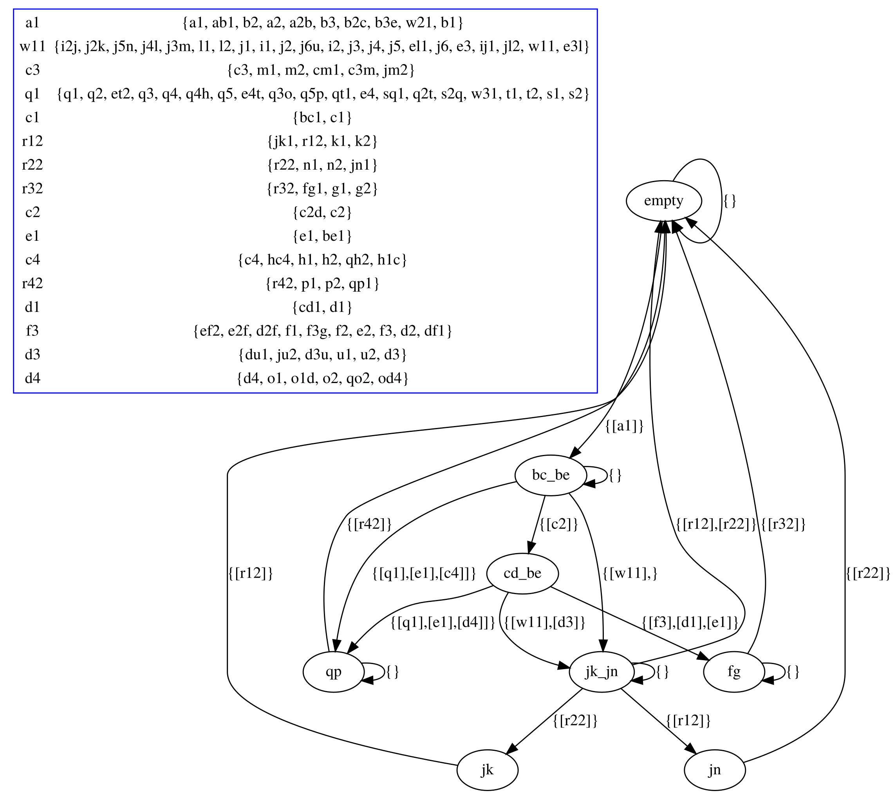

Example:

{"nodes":[{"Replicate":{"name":"A",
  "ends":[{"name":"A1",
    "type":"Source"},
    {"name":"A2",
      "type":"Sink"}]}},
  {"Replicate":{"name":"B",
    "ends":[{"name":"B1",
      "type":"Source"},
      {"name":"B2",
        "type":"Sink"},
      {"name":"B3",
        "type":"Sink"}]}},
  {"Route":{"name":"C",
    "ends":[{"name":"C1",
      "type":"Source"},
      {"name":"C2",
        "type":"Sink"},
      {"name":"C3",
        "type":"Sink"},
      {"name":"C4",
        "type":"Sink"}]}},
  {"Route":{"name":"D",
    "ends":[{"name":"D1",
      "type":"Source"},
      {"name":"D2",
        "type":"Sink"},
      {"name":"D3",
        "type":"Sink"},
      {"name":"D4",
        "type":"Sink"}]}},
  {"Route":{"name":"E",
    "ends":[{"name":"E1",
      "type":"Source"},
      {"name":"E2",
        "type":"Sink"},
      {"name":"E3",
        "type":"Sink"},
      {"name":"E4",
        "type":"Sink"}]}},
  {"Merge":{"name":"F",
    "ends":[{"name":"F1",
      "type":"Source"},
      {"name":"F2",
        "type":"Source"},
      {"name":"F3",
        "type":"Sink"}]}},
  {"Replicate":{"name":"G",
    "ends":[{"name":"G1",
      "type":"Source"},
      {"name":"G2",
        "type":"Sink"}]}},
  {"Replicate":{"name":"H",
    "ends":[{"name":"H1",
      "type":"Sink"},
      {"name":"H2",
        "type":"Source"}]}},
  {"Replicate":{"name":"I",
    "ends":[{"name":"I1",
      "type":"Source"},
      {"name":"I2",
        "type":"Sink"}]}},
  {"Replicate":{"name":"J",
    "ends":[{"name":"J1",
      "type":"Source"},
      {"name":"J2",
        "type":"Sink"},
      {"name":"J3",
        "type":"Sink"},
      {"name":"J4",
        "type":"Sink"},
      {"name":"J5",
        "type":"Sink"},
      {"name":"J5",
        "type":"Sink"}]}},
  {"Replicate":{"name":"K",
    "ends":[{"name":"K1",
      "type":"Source"},
      {"name":"K2",
        "type":"Sink"}]}},
  {"Replicate":{"name":"L",
    "ends":[{"name":"L1",
      "type":"Sink"},
      {"name":"L2",
        "type":"Source"}]}},
  {"Replicate":{"name":"M",
    "ends":[{"name":"M1",
      "type":"Sink"},
      {"name":"M2",
        "type":"Source"}]}},
  {"Replicate":{"name":"N",
    "ends":[{"name":"N1",
      "type":"Source"},
      {"name":"N2",
        "type":"Sink"}]}},
  {"Replicate":{"name":"O",
    "ends":[{"name":"O1",
      "type":"Sink"},
      {"name":"O2",
        "type":"Source"}]}},
  {"Replicate":{"name":"P",
    "ends":[{"name":"P1",
      "type":"Source"},
      {"name":"P2",
        "type":"Sink"}]}},
  {"Replicate":{"name":"Q",
    "ends":[{"name":"Q1",
      "type":"Source"},
      {"name":"Q2",
        "type":"Sink"},
      {"name":"Q3",
        "type":"Sink"},
      {"name":"Q4",
        "type":"Sink"},
      {"name":"Q5",
        "type":"Sink"}]}},
  {"Replicate":{"name":"S",
    "ends":[{"name":"S1",
      "type":"Source"},
      {"name":"S2",
        "type":"Sink"}]}},
  {"Replicate":{"name":"T",
    "ends":[{"name":"T1",
      "type":"Source"},
      {"name":"T2",
        "type":"Sink"}]}},
  {"Replicate":{"name":"U",
    "ends":[{"name":"U1",
      "type":"Sink"},
      {"name":"U2",
        "type":"Source"}]}}],
  "readers":[{"name":"R1",
    "ends":[{"name":"R12",
      "type":"Sink"}]},
    {"name":"R2",
      "ends":[{"name":"R22",
        "type":"Sink"}]},
    {"name":"R3",
      "ends":[{"name":"R32",
        "type":"Sink"}]},
    {"name":"R4",
      "ends":[{"name":"R42",
        "type":"Sink"}]}],
  "writers":[{"name":"W1",
    "ends":[{"name":"W11",
      "type":"Source"}]},
    {"name":"W2",
      "ends":[{"name":"W21",
        "type":"Source"}]},
    {"name":"W3",
      "ends":[{"name":"W31",
        "type":"Source"}]}],
  "channels":[{"Sync":[{"Source":"A2B"},
    {"Sink":"AB1"}]},
    {"FIFO":[{"Source":"B2C"},
      {"Sink":"BC1"}]},
    {"FIFO":[{"Source":"C2D"},
      {"Sink":"CD1"}]},
    {"Sync":[{"Source":"D2F"},
      {"Sink":"DF1"}]},
    {"FIFO":[{"Source":"F3G"},
      {"Sink":"FG1"}]},
    {"FIFO":[{"Source":"B3E"},
      {"Sink":"BE1"}]},
    {"Sync":[{"Source":"E2F"},
      {"Sink":"EF2"}]},
    {"SyncDrain":[{"Source":"E4T"},
      {"Source":"ET2"}]},
    {"Sync":[{"Source":"Q2T"},
      {"Sink":"QT1"}]},
    {"PrioritySync2":[{"Source":"S2Q"},
      {"Sink":"SQ1"}]},
    {"FIFO":[{"Source":"Q5P"},
      {"Sink":"QP1"}]},
    {"Lossy":[{"Source":"Q3O"},
      {"Sink":"QO2"}]},
    {"Lossy":[{"Source":"Q4H"},
      {"Sink":"QH2"}]},
    {"SyncDrain":[{"Source":"O1D"},
      {"Source":"OD4"}]},
    {"SyncDrain":[{"Source":"H1C"},
      {"Source":"HC4"}]},
    {"SyncDrain":[{"Source":"C3M"},
      {"Source":"CM1"}]},
    {"SyncDrain":[{"Source":"D3U"},
      {"Source":"DU1"}]},
    {"Lossy":[{"Source":"J3M"},
      {"Sink":"JM2"}]},
    {"Lossy":[{"Source":"J6U"},
      {"Sink":"JU2"}]},
    {"PrioritySync1":[{"Source":"I2J"},
      {"Sink":"IJ1"}]},
    {"FIFO":[{"Source":"J2K"},
      {"Sink":"JK1"}]},
    {"Sync":[{"Source":"J4L"},
      {"Sink":"JL2"}]},
    {"FIFO":[{"Source":"J5N"},
      {"Sink":"JN1"}]},
    {"SyncDrain":[{"Source":"E3L"},
      {"Source":"EL1"}]}],
  "connections":[{"one":"W11",
    "two":"I1"},
    {"one":"I2",
      "two":"I2J"},
    {"one":"J1","two":"IJ1"},
    {"one":"Q1","two":"SQ1"},
    {"one":"Q2","two":"Q2T"},
    {"one":"Q3","two":"Q3O"},
    {"one":"Q4","two":"Q4H"},
    {"one":"Q5","two":"Q5P"},
    {"one":"L2","two":"JL2"},
    {"one":"L1","two":"EL1"},
    {"one":"W21",
      "two":"A1"},
    {"one":"A2B",
      "two":"A2"},
    {"one":"AB1",
      "two":"B1"},
    {"one":"B2C",
      "two":"B2"},
    {"one":"B3E",
      "two":"B3"},
    {"one":"BC1",
      "two":"C1"},
    {"one":"C2D",
      "two":"C2"},
    {"one":"C3M",
      "two":"C3"},
    {"one":"C4",
      "two":"HC4"},
    {"one":"CD1",
      "two":"D1"},
    {"one":"D2F",
      "two":"D2"},
    {"one":"D3U",
      "two":"D3"},
    {"one":"OD4",
      "two":"D4"},
    {"one":"BE1",
      "two":"E1"},
    {"one":"E2F",
      "two":"E2"},
    {"one":"E3L",
      "two":"E3"},
    {"one":"E4T",
      "two":"E4"},
    {"one":"DF1",
      "two":"F1"},
    {"one":"EF2",
      "two":"F2"},
    {"one":"F3G",
      "two":"F3"},
    {"one":"FG1",
      "two":"G1"},
    {"one":"R32",
      "two":"G2"},
    {"one":"H1C",
      "two":"H1"},
    {"one":"QH2",
      "two":"H2"},
    {"one":"A2B",
      "two":"A2"},
    {"one":"J2K",
      "two":"J2"},
    {"one":"J3M",
      "two":"J3"},
    {"one":"J4L",
      "two":"J4"},
    {"one":"J5N",
      "two":"J5"},
    {"one":"J6U",
      "two":"J6"},
    {"one":"JK1",
      "two":"K1"},
    {"one":"R12",
      "two":"K2"},
    {"one":"CM1",
      "two":"M1"},
    {"one":"JM2",
      "two":"M2"},
    {"one":"JN1",
      "two":"N1"},
    {"one":"R22",
      "two":"N2"},
    {"one":"O1D",
      "two":"O1"},
    {"one":"QO2",
      "two":"O2"},
    {"one":"A2B",
      "two":"A2"},
    {"one":"QP1",
      "two":"P1"},
    {"one":"R42",
      "two":"P2"},
    {"one":"W31",
      "two":"S1"},
    {"one":"S2Q",
      "two":"S2"},
    {"one":"QT1",
      "two":"T1"},
    {"one":"ET2",
      "two":"T2"},
    {"one":"DU1",
      "two":"U1"},
    {"one":"JU2",
      "two":"U2"}
    ]}

